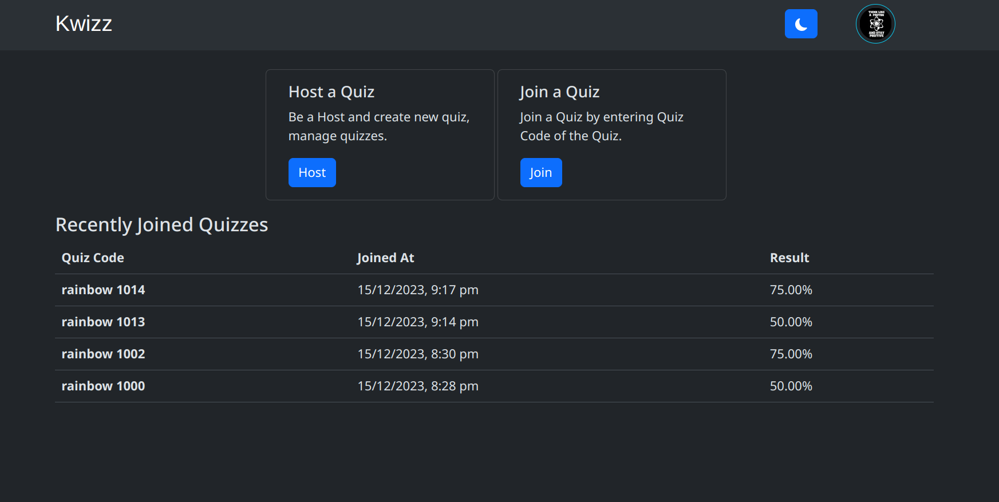
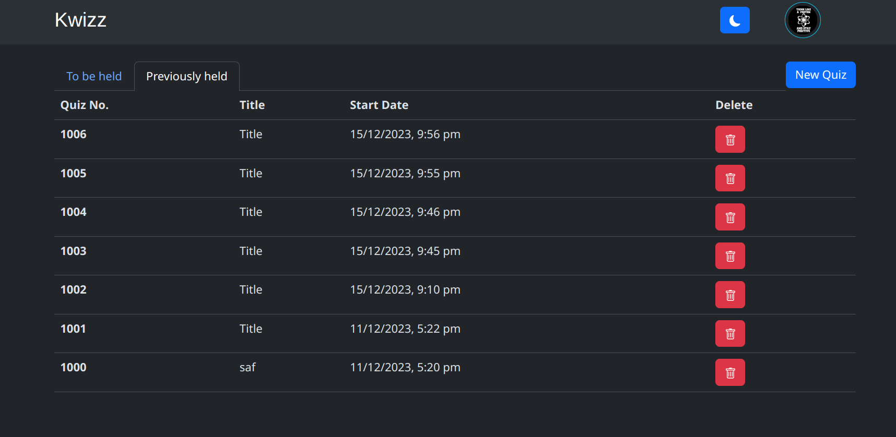
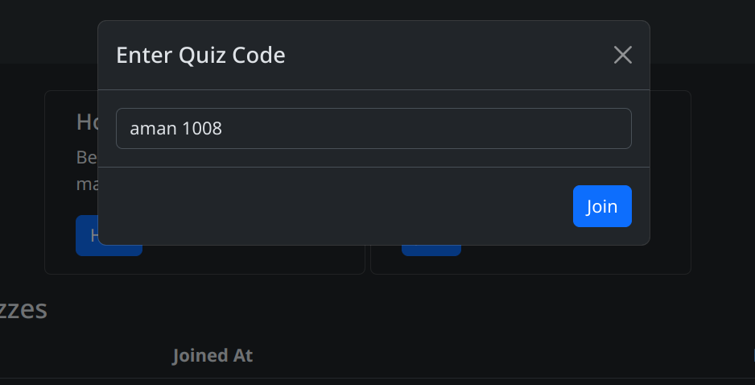

# Kwizz

## Description

A web-based quiz management system built with Django and Socket.IO for real-time interactions. This project allows for the creation, management, and participation in quizzes with live updates.

## Features

- **Quiz Creation and Management**: Host can create and manage quizzes, including questions and answer choices.
- **User Participation**: Users can join quizzes, answer questions, and view real-time results.
- **Real-time Updates**: Use of Socket.IO to provide real-time updates during quizzes.
- **Open Authorization**: Users are authenticated using Google OAuth 2.0.
- **Responsive UI**: Bootstrap components are used for responsiveness.  

## Screenshots

### 1. Home Page


### 2. Host Page


### 3. Join Page


## Tech Stack

- **Django**: Web framework for backend development.
- **Socket.IO**: For real-time, bidirectional communication.

## Installation

1. Clone the repository:
   ```bash
   git clone https://github.com/hisuperaman/kwizz.git .
2. Create and activate a virtual environment:
    ```bash
    python -m venv .venv
    source .venv/bin/activate  # On Windows use `.venv\Scripts\activate`
3. Install dependencies:
    ```bash
    pip install -r requirements.txt
4. Navigate to project directory:
    ```bash
    cd kwizz
5. Configure Environment Variables: Create a .env file and add environment variables
    ```bash
    CLIENT_ID = your_oauth_client_id
    CLIENT_SECRET = your_oauth_client_secret

    AUTHORIZATION_URL = "https://accounts.google.com/o/oauth2/auth" # for google
    TOKEN_URL = "https://accounts.google.com/o/oauth2/token" # for google
    REDIRECT_URI = "http://localhost:8000/callback" # for local machine
    SCOPES = "https://www.googleapis.com/auth/userinfo.email https://www.googleapis.com/auth/userinfo.profile" # scopes of permissions
6. Apply migrations:
    ```bash
    python manage.py migrate
## Running the Project

1. Run the development server:
   ```bash
   python manage.py runserver
## Contributing

Contributions are welcome! Feel free to submit a pull request or open an issue.

## License

This project is licensed under the MIT License.